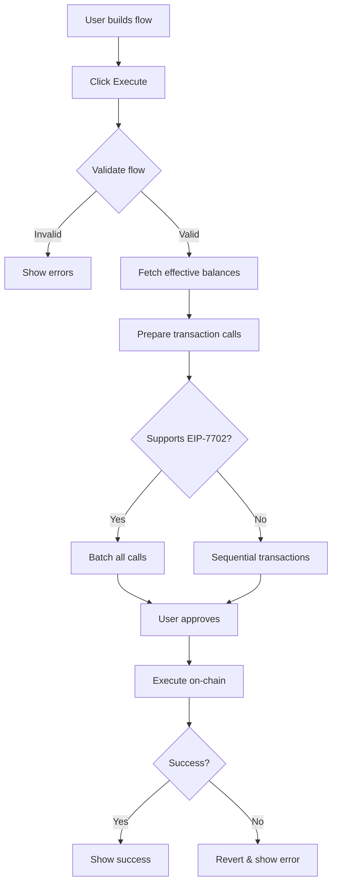

# Ethkratong

**Visual DeFi Strategy Builder with Atomic Execution**

Ethkratong is a no-code visual interface for building and executing complex DeFi strategies as atomic batched transactions. Design multi-step workflows involving lending, borrowing, swapping, and custom contract interactions—all executed in a single transaction using EIP-7702.

---

## Table of Contents

- [Key Features](#key-features)
- [Protocol Support](#protocol-support)
- [How It Works](#how-it-works)
- [Sharing & Collaboration](#sharing--collaboration)
- [Getting Started](#getting-started)
- [Usage Examples](#usage-examples)
- [Architecture](#architecture)
- [Tech Stack](#tech-stack)
- [Project Structure](#project-structure)
- [Contributing](#contributing)

---

## Key Features

### Visual Flow Builder

Build DeFi strategies using an intuitive drag-and-drop canvas powered by React Flow. Connect protocol actions together to visualize and design complex transaction flows.

- **Node-based interface**: Each protocol action is represented as a node
- **Visual connections**: Drag edges between nodes to define execution order
- **Real-time validation**: See balance flows and transaction previews as you build
- **Multi-tab support**: Work on multiple strategies simultaneously

### EIP-7702 Atomic Batching

Execute entire strategies as a single atomic transaction using EIP-7702 batched delegation calls. If any step fails, the entire transaction reverts—no partial execution, no stuck funds.

**Benefits:**
- **Atomic execution**: All-or-nothing guarantee
- **Gas efficiency**: One transaction for multiple operations
- **MEV protection**: No opportunity for sandwich attacks between steps
- **Simplified UX**: One approval, one signature

### Effective Balance Tracking

The system tracks balances through your entire workflow, accounting for outputs from previous steps:

```
Wallet (1000 USDC)
  → Aave Deposit (1000 USDC) → receive 1000 aUSDC
  → Aave Borrow (500 DAI) → effective balance: 500 DAI
  → Uniswap Swap (500 DAI → 0.15 ETH) → effective balance: 0.15 ETH
```

Each subsequent node can reference the outputs of previous nodes, enabling intelligent amount calculations and validations.

### Conditional Logic

Add conditional execution based on on-chain data:

- **View function comparison**: Call any view function and compare the result
- **Balance checks**: Execute based on ETH balance of any address
- **Operators**: `>`, `>=`, `<`, `<=`, `!=`
- **Skip on failure**: Nodes are skipped if conditions aren't met

### Custom Contract Interaction

Interact with any verified contract on Etherscan:

1. Paste contract address
2. Automatically fetch ABI from Etherscan
3. Select any function
4. Fill in parameters
5. Include in your batched execution

### Protocol-Specific Features

#### Aave V3
- **Actions**: Deposit, Withdraw, Borrow, Repay
- **Real-time data**: Live APY rates and LTV ratios from Aave subgraph
- **Interest rate modes**: Variable or stable borrowing rates
- **Estimated outputs**: Preview aTokens received on deposit
- **Action gating**: Borrow/withdraw only available after depositing collateral

#### Morpho Blue Vaults
- **Actions**: Lend (deposit), Redeem (withdraw), Borrow
- **Vault discovery**: Browse available vaults with APY rankings
- **Auto-wrap ETH**: Automatically wrap ETH to WETH for vault deposits
- **Estimated shares**: Preview vault shares received
- **Real-time APY**: Live yield rates for all vaults

#### Uniswap
- **Swap**: Trade tokens with slippage protection
- **Add Liquidity**: Provide liquidity to pools, receive LP tokens
- **Remove Liquidity**: Burn LP tokens, receive underlying assets
- **Estimated outputs**: Preview expected amounts with live pricing
- **Slippage controls**: Configure max slippage or use automatic
- **Deadline protection**: Set transaction deadline (default: 30 minutes)

### Sharing & Collaboration

#### Public Sharing
Upload your flow to IPFS and share via link or QR code:

- **Decentralized storage**: Flows stored on IPFS via Pinata
- **Permanent links**: Immutable content addressing
- **QR code generation**: Scan to open on mobile devices
- **Cross-device**: Build on desktop, execute on mobile

#### Private Encrypted Sharing
End-to-end encrypted sharing for sensitive strategies:

```
Flow → Encrypt (client-side) → Upload to IPFS → Share link with key
```

- **Client-side encryption**: AES-GCM 256-bit encryption in browser
- **Key in URL fragment**: Encryption key never sent to server
- **Zero-knowledge**: IPFS sees only encrypted blob
- **One-time share**: Key cannot be recovered if link is lost

**URL Format:**
- Public: `https://app.com?s=QmXXX`
- Private: `https://app.com?s=QmYYY#key=abc123`

### Multi-Chain Support

Currently supports:
- **Ethereum Mainnet** (Chain ID: 1)
- **Arbitrum One** (Chain ID: 42161)

Chain-aware protocol addresses and automatic token resolution per network.

### Wallet Integration

Powered by Thirdweb's Wallet SDK:
- **Multiple wallet options**: MetaMask, WalletConnect, Coinbase Wallet, etc.
- **EIP-7702 detection**: Automatic fallback to sequential execution if not supported
- **Balance fetching**: Real-time wallet balances for all supported tokens
- **Multi-chain switching**: Seamless network changes

---

## Protocol Support

| Protocol | Supported Actions | Status |
|----------|------------------|--------|
| **Aave V3** | Deposit, Withdraw, Borrow, Repay | ✅ Live |
| **Morpho Blue** | Lend, Redeem, Borrow | ✅ Live |
| **Uniswap** | Swap, Add Liquidity | ✅ Live |
| **Transfer** | ETH/ERC20 transfers | ✅ Live |
| **Custom Contracts** | Any verified contract | ✅ Live |
| **Conditional Logic** | View function checks | ✅ Live |
| **Balance Logic** | ETH balance checks | ✅ Live |
| Compound V3 | Lend, Borrow | 🚧 Planned |
| Curve | Swap, Stake | 🚧 Planned |
| Pendle | YT/PT trading | 🚧 Planned |

---

## How It Works

### 1. Design Your Strategy

```
┌─────────────┐      ┌──────────────┐      ┌──────────────┐
│   Wallet    │ ───> │ Aave Deposit │ ───> │ Aave Borrow  │
│  (USDC)     │      │ 1000 USDC    │      │  500 DAI     │
└─────────────┘      └──────────────┘      └──────────────┘
                            │                      │
                            v                      v
                      [aUSDC Balance]        [DAI Balance]
                            │                      │
                            └──────────┬───────────┘
                                       v
                            ┌──────────────────┐
                            │  Morpho Lend     │
                            │  500 DAI         │
                            └──────────────────┘
```

### 2. Preview Execution

The right drawer shows:
- **Execution order**: Nodes sorted by dependency
- **Transaction calls**: Each smart contract call to be made
- **Balance changes**: Expected balance after each step
- **Estimated outputs**: Swap amounts, vault shares, aTokens, etc.

### 3. Execute Atomically

When you click "Launch Your Kratong":

```javascript
// All operations batched into single EIP-7702 transaction
[
  { to: USDC, data: approve(AavePool, 1000e6) },
  { to: AavePool, data: supply(USDC, 1000e6, user) },
  { to: AavePool, data: borrow(DAI, 500e18, rateMode, user) },
  { to: DAI, data: approve(MorphoVault, 500e18) },
  { to: MorphoVault, data: deposit(500e18, user) }
]
```

If your wallet supports EIP-7702, all calls execute atomically. Otherwise, falls back to sequential execution.

### 4. Share or Save

- **Export as JSON**: Save your flow locally
- **Upload to IPFS**: Get permanent shareable link
- **Encrypt**: Optional client-side encryption for private sharing

---

## Sharing & Collaboration

### Architecture

```
┌─────────────────────────────────────────────────────────────────┐
│                         Your Browser                            │
│                                                                 │
│  ┌──────────────┐                           ┌───────────────┐  │
│  │ Flow Builder │ ──[Export]──> [Encrypt?] ─>│ IPFS Upload  │  │
│  └──────────────┘                           └───────┬───────┘  │
│                                                      │          │
└──────────────────────────────────────────────────────┼──────────┘
                                                       │
                                                       v
                                              ┌─────────────────┐
                                              │  IPFS Network   │
                                              │   (Pinata)      │
                                              └────────┬────────┘
                                                       │
                                                       v
                                              QmXXX... (CID)
                                                       │
                                                       v
                                    https://app.com?s=QmXXX#key=...
                                                       │
                                                       v
┌──────────────────────────────────────────────────────┼──────────┐
│                    Recipient's Browser               │          │
│                                                      │          │
│  ┌───────────────┐                      ┌──────────────────┐   │
│  │ Load from URL │ ─[Fetch IPFS]──> [Decrypt?] ─>│ Flow Canvas│   │
│  └───────────────┘                      └──────────────────┘   │
│                                                                 │
└─────────────────────────────────────────────────────────────────┘
```

### Public vs Private Sharing

**Public Sharing:**
- Flow data uploaded as plain JSON
- Anyone with CID can view
- Ideal for educational content, templates, public strategies

**Private Sharing:**
- Flow encrypted with AES-GCM before upload
- Encryption key included in URL fragment (#key=...)
- Fragment never sent to servers (client-side only)
- IPFS sees only encrypted blob
- Perfect for proprietary strategies, personal flows

---

## Getting Started

### Prerequisites

- Node.js 18+ or Bun
- A wallet (MetaMask, Coinbase Wallet, etc.)
- ETH/USDC on Ethereum Mainnet or Arbitrum (for testing)

### Installation

```bash
# Clone the repository
git clone https://github.com/yourusername/ethkratong.git
cd ethkratong

# Install dependencies
bun install
# or
npm install

# Set up environment variables
cp .env.example .env
```

### Environment Variables

Create a `.env` file:

```env
# Required: Pinata for IPFS uploads
VITE_PINATA_JWT=your_pinata_jwt_token
VITE_PINATA_GATEWAY=gateway.pinata.cloud

# Optional: Thirdweb Client ID
VITE_THIRDWEB_CLIENT_ID=your_client_id

# Optional: Custom share URL base
VITE_SHARE_BASE_URL=https://yourdomain.com
```

Get Pinata JWT at: https://pinata.cloud

### Run Development Server

```bash
bun run dev
# or
npm run dev
```

Open http://localhost:5173

### Build for Production

```bash
bun run build
# or
npm run build
```

---

## Usage Examples

### Example 1: Leveraged Lending

**Goal**: Deposit USDC to Aave, borrow ETH, lend ETH to Morpho for higher yield

```
1. Wallet → Aave (Deposit 1000 USDC)
   - Action: Deposit
   - Asset: USDC
   - Amount: 1000
   - Output: 1000 aUSDC

2. Aave → Aave (Borrow ETH against collateral)
   - Action: Borrow
   - Asset: ETH
   - Amount: 0.3 (based on 75% LTV)
   - Rate: Variable

3. Aave → Morpho (Lend borrowed ETH)
   - Action: Lend
   - Asset: ETH
   - Vault: Steakhouse ETH (4.68% APY)
   - Amount: 0.3
   - Output: ~0.29 vault shares
```

**Result**: 6 transactions batched into 1:
1. Approve USDC for Aave
2. Supply USDC to Aave
3. Borrow ETH from Aave
4. Wrap ETH → WETH
5. Approve WETH for Morpho
6. Deposit WETH to Morpho vault

### Example 2: Conditional Rebalancing

**Goal**: Only swap if ETH price is above a threshold

```
1. Wallet → Conditional (Check ETH/USDC price)
   - Contract: Uniswap Pair (ETH/USDC)
   - Function: getReserves()
   - Condition: reserve1/reserve0 > 3000 (price > $3000)

2. Conditional → Uniswap (Swap if condition met)
   - Action: Swap
   - From: USDC
   - To: ETH
   - Amount: 5000
   - Slippage: 0.5%
```

If ETH < $3000, swap is skipped. If ETH > $3000, swap executes.

### Example 3: Liquidity Provision

**Goal**: Provide liquidity to Uniswap ETH/USDC pool

```
1. Wallet → Uniswap (Add Liquidity)
   - Token A: ETH
   - Token B: USDC
   - Amount: 1 ETH (USDC amount auto-calculated)
   - Output: ~50 ETH-USDC LP tokens

2. Uniswap → Transfer (Send LP tokens elsewhere)
   - Asset: ETH-USDC LP
   - Amount: 50
   - To: 0x742d35Cc6634C0532925a3b844Bc9e7595f0bEb
```

### Example 4: Custom Contract Interaction

**Goal**: Interact with any verified contract

```
1. Wallet → Custom Contract
   - Address: 0x1234... (paste any verified contract)
   - Function: stake(uint256 amount)
   - Parameters: amount = 1000000000000000000 (1e18)

2. Custom → Custom (Chain multiple custom calls)
   - Address: 0x5678...
   - Function: claim()
```

---

## Architecture

### Component Structure

```
┌─────────────────────────────────────────────────────────────┐
│                        Flow Canvas                          │
│  ┌────────────┐  ┌────────────┐  ┌────────────┐           │
│  │  Protocol  │─>│  Protocol  │─>│  Protocol  │           │
│  │   Node 1   │  │   Node 2   │  │   Node 3   │           │
│  └────────────┘  └────────────┘  └────────────┘           │
└─────────────────────────────────────────────────────────────┘
         │                    │                    │
         v                    v                    v
┌─────────────────────────────────────────────────────────────┐
│              Effective Balance Tracker                      │
│  Calculates available balances through the flow             │
└─────────────────────────────────────────────────────────────┘
         │                    │                    │
         v                    v                    v
┌─────────────────────────────────────────────────────────────┐
│              Batched Execution Engine                       │
│  prepareBatchedCalls() → Array<{to, data, value}>          │
└─────────────────────────────────────────────────────────────┘
         │
         v
┌─────────────────────────────────────────────────────────────┐
│                    EIP-7702 Batch                           │
│  Single atomic transaction with multiple delegate calls     │
└─────────────────────────────────────────────────────────────┘
```

### Execution Flow



### Data Flow for IPFS Sharing

```
Build Flow
    │
    ├─> Export to JSON
    │
    ├─> [Optional] Encrypt with AES-GCM
    │       │
    │       └─> Generate random 256-bit key
    │
    ├─> Upload to Pinata IPFS
    │       │
    │       └─> Receive CID (QmXXX...)
    │
    ├─> Generate shareable URL
    │       │
    │       ├─> Public: ?s=QmXXX
    │       └─> Private: ?s=QmXXX#key=abc123
    │
    └─> Generate QR Code
```

---

## Tech Stack

### Core
- **React 18** - UI framework
- **TypeScript** - Type safety
- **Vite** - Build tool and dev server

### Blockchain
- **Thirdweb SDK** - Wallet connection and blockchain interactions
- **viem** - Ethereum library for encoding/decoding
- **EIP-7702** - Batched delegation calls

### UI/UX
- **@xyflow/react** - Flow diagram canvas
- **Tailwind CSS** - Styling
- **Radix UI** - Accessible component primitives
- **Lucide Icons** - Icon library
- **qrcode.react** - QR code generation

### Storage & Sharing
- **Pinata SDK** - IPFS uploads
- **Web Crypto API** - Client-side encryption

### Data Fetching
- **GraphQL** - Aave/Morpho subgraph queries
- **Etherscan API** - Contract ABI fetching

---

## Project Structure

```
ethkratong/
├── src/
│   ├── components/
│   │   ├── nodes/                    # Protocol node components
│   │   │   ├── protocol-node/
│   │   │   │   ├── ProtocolNode.tsx
│   │   │   │   ├── ProtocolNodeAaveBody.tsx
│   │   │   │   ├── ProtocolNodeMorphoBody.tsx
│   │   │   │   ├── ProtocolNodeUniswapBody.tsx
│   │   │   │   ├── ProtocolNodeCompactView.tsx
│   │   │   │   ├── useProtocolNode.ts
│   │   │   │   ├── useAaveReserves.ts
│   │   │   │   ├── useMorphoVaults.ts
│   │   │   │   └── effectiveBalances.ts
│   │   │   └── wallet-node/
│   │   ├── layout/
│   │   │   ├── Sidebar.tsx           # Protocol sidebar
│   │   │   ├── Toolbar.tsx           # Top toolbar
│   │   │   ├── RightDrawer.tsx       # Execution preview
│   │   │   └── Tabs.tsx              # Multi-tab support
│   │   ├── dialogs/
│   │   ├── overlays/
│   │   ├── ShareDialog.tsx           # IPFS sharing UI
│   │   └── Flow.tsx                  # Main canvas
│   ├── services/
│   │   ├── batchedExecution.ts       # EIP-7702 batch preparation
│   │   ├── aaveApi.ts                # Aave data fetching
│   │   ├── morphoApi.ts              # Morpho data fetching
│   │   └── etherscan.ts              # ABI fetching
│   ├── lib/
│   │   ├── ipfs.ts                   # IPFS upload/download
│   │   ├── crypto.ts                 # Encryption/decryption
│   │   ├── flow.ts                   # Flow utilities
│   │   └── utils.ts
│   ├── hooks/
│   │   ├── useFlowShare.ts           # Sharing logic
│   │   ├── useSharedFlowLoader.ts    # Load shared flows
│   │   └── useFlowWorkspace.ts       # Multi-tab management
│   ├── data/
│   │   └── protocols.ts              # Protocol definitions
│   └── types/
│       └── index.ts                  # TypeScript types
├── public/
└── package.json
```

---

## Contributing

Contributions are welcome! Here are some areas where you can help:

### Protocol Integrations
- Add Compound V3 support
- Add Curve swap/stake support
- Add Pendle PT/YT trading
- Add Balancer pool interactions

### Features
- Transaction simulation before execution
- Gas estimation and optimization
- APY optimization suggestions
- Historical strategy backtesting
- Mobile app (React Native)
- Strategy templates library

### UX Improvements
- Undo/redo for canvas edits
- Keyboard shortcuts
- Node search/filtering
- Auto-layout algorithms
- Accessibility improvements

### Development Setup

1. Fork the repository
2. Create a feature branch: `git checkout -b feature/your-feature`
3. Make your changes
4. Test thoroughly
5. Commit: `git commit -m 'Add your feature'`
6. Push: `git push origin feature/your-feature`
7. Open a Pull Request

### Testing

```bash
# Run type check
bun run type-check

# Run linter
bun run lint

# Build to verify
bun run build
```

---

## Security Considerations

### Smart Contract Interactions
- Always verify contract addresses before interaction
- Test strategies with small amounts first
- Understand liquidation risks when borrowing
- Monitor health factors for leveraged positions

### Private Sharing
- Encryption key is only as secure as the URL
- Don't share private links over insecure channels
- Consider key cannot be recovered if link is lost
- Encrypted data on IPFS is permanent

### Wallet Security
- Never share your private keys or seed phrase
- Review transaction details before signing
- Understand what contracts you're approving
- Use hardware wallets for large amounts

---

## Roadmap

### Q1 2026
- ✅ Aave V3 integration
- ✅ Morpho Blue integration
- ✅ Uniswap swap & liquidity
- ✅ IPFS sharing (public & private)
- ✅ Conditional execution
- ✅ Custom contract interaction

### Q2 2026
- [ ] Compound V3 integration
- [ ] Curve swap/stake support
- [ ] Transaction simulation
- [ ] Gas optimization
- [ ] Mobile responsive design

### Q3 2026
- [ ] Strategy templates marketplace
- [ ] APY optimization engine
- [ ] Historical backtesting
- [ ] Multi-sig support
- [ ] Advanced analytics

### Q4 2026
- [ ] Mobile app (iOS/Android)
- [ ] Cross-chain strategies
- [ ] AI strategy suggestions
- [ ] Governance integration
- [ ] Educational content

---

## License

MIT License - see [LICENSE](LICENSE) file for details

---

## Acknowledgments

- Inspired by [rawbit.io](https://github.com/rawBit-io/rawbit) - Bitcoin transaction visualizer
- Built with [React Flow](https://reactflow.dev/) - Amazing flow diagram library
- Powered by [Thirdweb](https://thirdweb.com/) - Web3 development platform
- Storage by [Pinata](https://pinata.cloud/) - IPFS pinning service
- Protocol data from [Aave](https://aave.com/), [Morpho](https://morpho.org/), [Uniswap](https://uniswap.org/)

---

## Support

- **Documentation**: [docs.yourdomain.com](https://docs.yourdomain.com)
- **Discord**: [Join our community](https://discord.gg/yourserver)
- **Twitter**: [@ethkratong](https://twitter.com/ethkratong)
- **Email**: support@yourdomain.com

---

**Built with love for the DeFi community**
